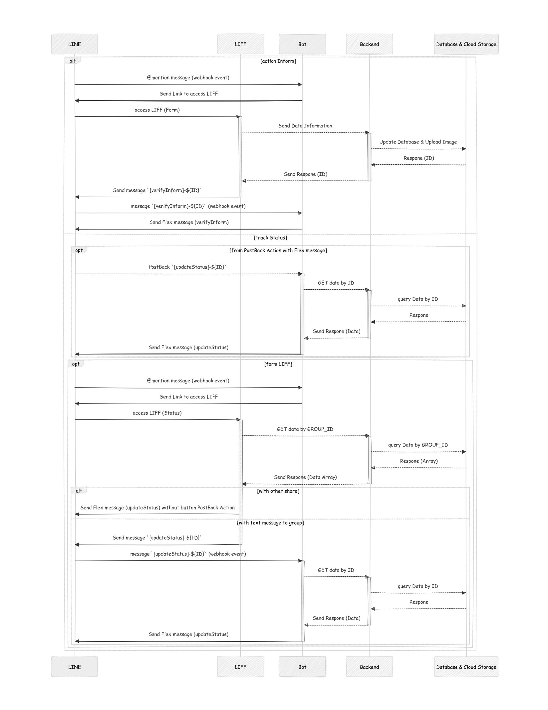
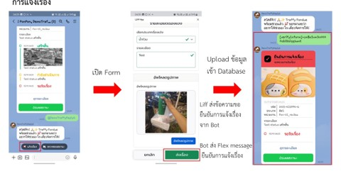

# LINE-Group-Bot

# Sequence Diagram


# VDO Demo

1. Video Demo 1 การแจ้งเรื่อง
<video controls>
    <source src="media/Screen_Recording_20250504_135858_LINE.mp4" type="video/mp4">
</video>
2. Video Demo 2 ตรวจสอบสถานะ ผ่าน LIFF
<video controls>
    <source src="media/Screen_Recording_20250504_140023_LINE.mp4" type="video/mp4">
</video>
3. Video Demo 3 การแชร์เข้าสู่กลุ่ม และ อัปเดตสถานะจากปุ่มบน Flex Message
<video controls>
    <source src="media/Screen_Recording_20250504_140139_LINE.mp4" type="video/mp4">
</video>
4. Video Demo 4 การแชร์ไปยังภายนอกกลุ่ม
<video controls>
    <source src="media/Screen_Recording_20250504_140249_LINE.mp4" type="video/mp4">
</video>
5. Video Demo 5 การตั้งค่าเริ่มต้นของหน่วยงานที่รับแจ้งของกลุ่ม
<video controls>
    <source src="media/Screen_Recording_20250504_154009_LINE.mp4" type="video/mp4">
</video>

# Deployments
### Option 1: Install new SSL certificates
 - Start the docker-compose file
```bash
docker-compose up --build -d nginx
```
 - Install certbot
```bash
sudo apt -y install certbot
```
 - Run certbot
```bash
sudo certbot certonly --webroot -w ./nginx/certbot/www \
  --config-dir ./nginx/certbot/conf \
  --logs-dir ./nginx/certbot/logs \
  --work-dir ./nginx/certbot/work \
  --email {youremail@example.com} --agree-tos --no-eff-email \
  -d {yourdomain.com}
```
 - Uncomment the `nginx.conf` file and replace the domain name with your domain name
```
    ...

    # server {
    #     listen 443 ssl;
    #     server_name {yourdomain.com};

    #     ssl_certificate /etc/letsencrypt/live/{yourdomain.com}/fullchain.pem;
    #     ssl_certificate_key /etc/letsencrypt/live/{yourdomain.com}/privkey.pem;

    #     location /bot/ {
    #         proxy_pass http://line-bot:3000;
    #         proxy_set_header Host $host;
    #         proxy_set_header X-Real-IP $remote_addr;
    #         proxy_set_header X-Forwarded-For $proxy_add_x_forwarded_for;
    #         proxy_set_header X-Forwarded-Proto $scheme;
    #     }

    #     location /ff/ {
    #         proxy_pass http://liff-service:3001;
    #         proxy_set_header Host $host;
    #         proxy_set_header X-Real-IP $remote_addr;
    #         proxy_set_header X-Forwarded-For $proxy_add_x_forwarded_for;
    #         proxy_set_header X-Forwarded-Proto $scheme;
    #     }

    #    location /backend/ {
    #        proxy_pass http://backend:3002;
    #        proxy_http_version 1.1;
    #        proxy_set_header Upgrade $http_upgrade;
    #        proxy_set_header Connection 'upgrade';
    #        proxy_set_header Host $host;
    #        proxy_set_header X-Real-IP $remote_addr;
    #        proxy_set_header X-Forwarded-For $proxy_add_x_forwarded_for;
    #        proxy_set_header X-Forwarded-Proto $scheme;
    #    }

    #    location /public/ {
    #        root /var/www;
    #        allow all;
    #    }
    # }

    ...
```
 - Restart the docker-compose file
```bash
docker-compose down
docker-compose up
```

### Option 2: Use existing SSL certificates
 - Uncomment the `nginx/nginx.conf` file and replace the domain name with your domain name
```nginx.conf
events {}
    ...
    # server {
    #     listen 443 ssl;
    #     server_name {yourdomain.com};

    #     ssl_certificate /etc/letsencrypt/live/{yourdomain.com}/fullchain.pem;
    #     ssl_certificate_key /etc/letsencrypt/live/{yourdomain.com}/privkey.pem;

    #     location /bot/ {
    #         proxy_pass http://line-bot:3000;
    #         proxy_set_header Host $host;
    #         proxy_set_header X-Real-IP $remote_addr;
    #         proxy_set_header X-Forwarded-For $proxy_add_x_forwarded_for;
    #         proxy_set_header X-Forwarded-Proto $scheme;
    #     }

    #     location /ff/ {
    #         proxy_pass http://liff-service:3001;
    #         proxy_set_header Host $host;
    #         proxy_set_header X-Real-IP $remote_addr;
    #         proxy_set_header X-Forwarded-For $proxy_add_x_forwarded_for;
    #         proxy_set_header X-Forwarded-Proto $scheme;
    #     }
    # }
    ...
```
 - Edit the `docker-compose.yml` file, replace `{path to your SSL certificates}` with the path to your SSL certificates and `{path to webroot}` with the path to the webroot
```docker-compose.yml
version: '3.7'
    ...
  nginx:
    ...
    volumes:
      - ./nginx/nginx.conf:/etc/nginx/nginx.conf:ro
      - {path to webroot}:/var/www/certbot:ro
      - {path to your SSL certificates}:/etc/letsencrypt:ro
    ...
```
 - Start the docker-compose file
```bash
docker-compose up
```

## Setup Line Console
### Messaging API
1. Webhook URL: https://{your_domain.com}/bot/callback
### LIFF App
1. Endpoint URL: https://{your_domain.com}/ff
2. Scopes: `profile`, `openid`?, `chat_message.write`
3. Scan QR: `true`
4. Module mode: `true`
### Line Login
1. Callback URL:
    - https://{your_domain.com}/ff

## API Usage
- [LINE Messaging API](https://developers.line.biz/en/docs/messaging-api/overview/)
    1. channel secret
    2. channel access token
- [LINE LIFF API](https://developers.line.biz/en/docs/liff/overview/)
    1. LIFF ID
- [OpenStreetMap API by Traces Track](https://console.tracestrack.com/)
    1. API Key
- [RapidAPI](https://rapidapi.com/castelli0giovanni-VdUSmLXuCR3/api/feroeg-reverse-geocoding/playground/apiendpoint_25fdc514-102d-4c92-bd75-92c8ea9e364d)
    1. API Key